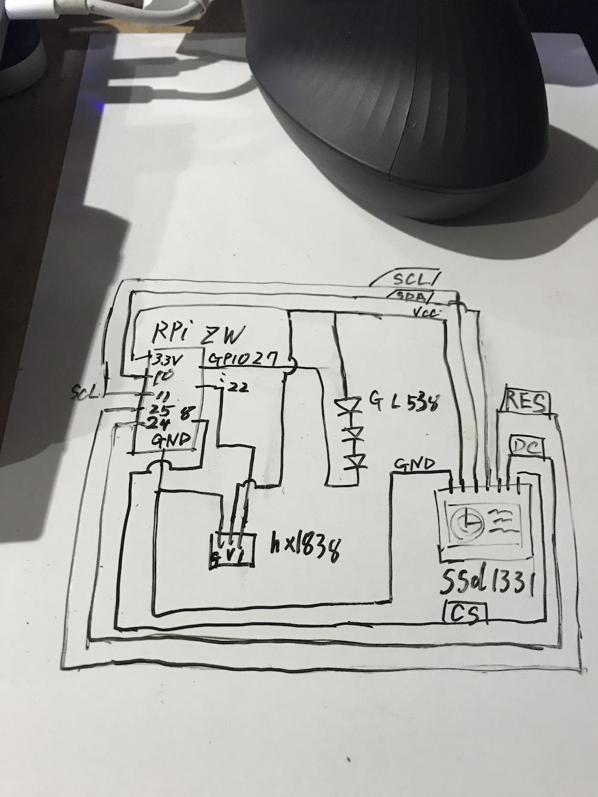

# IrControl
construct for raspi ZeroW with lircd

## lircd setup memo
### recipe
- raspberrypi Zero W with stretch
```
$ cat /proc/cpuinfo
processor	: 0
model name	: ARMv6-compatible processor rev 7 (v6l)
BogoMIPS	: 697.95
Features	: half thumb fastmult vfp edsp java tls
CPU implementer	: 0x41
CPU architecture: 7
CPU variant	: 0x0
CPU part	: 0xb76
CPU revision	: 7

Hardware	: BCM2835
Revision	: 9000c1
$ uname -a
Linux raspberrypi_zw 4.14.62+ #1134 Tue Aug 14 16:58:07 BST 2018 armv6l GNU/Linux
$ lsb_release -a
No LSB modules are available.
Distributor ID:	Raspbian
Description:	Raspbian GNU/Linux 9.4 (stretch)
Release:	9.4
Codename:	stretch
```

- circuit


- /boot/config.txt
```
dtoverlay=lirc-rpi:gpio_out_pin=25,gpio_in_pin=24,gpio_in_pull=up,invert=on
```
