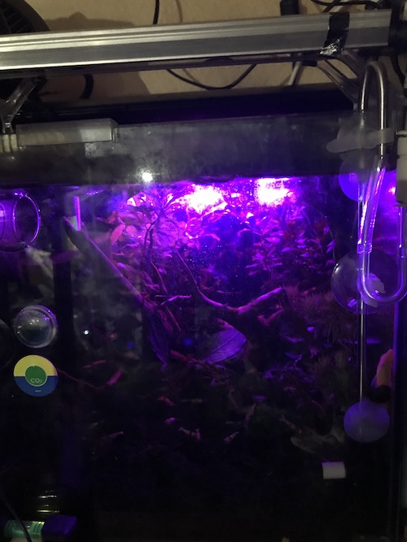

# IrControl
construct for raspi ZeroW with lircd

## Motivation
I wanna simulate sunlight (e.g., SunRise/Set, MoonLight, etc...) with RGB ledlight by time in water plants tank as a sublight.<br>

like below.<br>



## lircd setup memo
### H/W recipe
- raspberrypi Zero W with stretch
```
$ cat /proc/cpuinfo
processor	: 0
model name	: ARMv6-compatible processor rev 7 (v6l)
BogoMIPS	: 697.95
Features	: half thumb fastmult vfp edsp java tls
CPU implementer	: 0x41
CPU architecture: 7
CPU variant	: 0x0
CPU part	: 0xb76
CPU revision	: 7

Hardware	: BCM2835
Revision	: 9000c1
$ uname -a
Linux raspberrypi_zw 4.14.62+ #1134 Tue Aug 14 16:58:07 BST 2018 armv6l GNU/Linux
$ lsb_release -a
No LSB modules are available.
Distributor ID:	Raspbian
Description:	Raspbian GNU/Linux 9.4 (stretch)
Release:	9.4
Codename:	stretch
```

#### circuit diagram


#### /boot/config.txt (see also. environments/boot/config.txt l.51)
```
dtoverlay=lirc-rpi:gpio_out_pin=25,gpio_in_pin=24,gpio_in_pull=up,invert=on
```

#### [ledlight](https://www.amazon.co.jp/gp/product/B079QKB128/ref=oh_aui_detailpage_o05_s00?ie=UTF8&psc=1)
I use a ready-made ledlight with RGB Infra-red remote controller by 24Key, because a number of ledlights can be controlled at the same time very simply.<br><br>
The docs are written for use like https://www.led-paradise.com/product/1301.<br><br>
Why? Many cheap RGB controller (maybe chinese) have same IR signal, and they are cheaper than wifi or BT's similar products.

#### appearance

