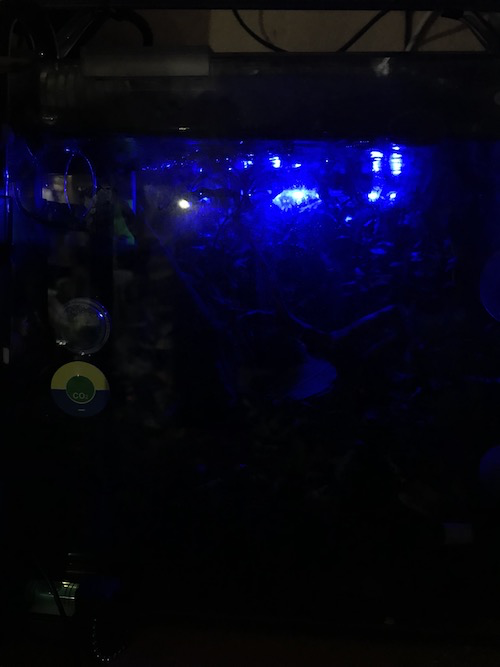

# IrControl
construct for raspi ZeroW with lircd

## Motivation
I wanna simulate sunlight (e.g., SunRise/Set, MoonLight, etc...) with RGB ledlight by time in water plants tank as a sublight.<br>

like below.<br>




## lircd setup memo
On the premise, check one by one, from here to bottom in order.
If there are a point which you can shortcut, I've put [shortcut] link.

[H/W](./HW.md)

#### <a name="light"></a>[ledlight](https://www.amazon.co.jp/gp/product/B079QKB128/ref=oh_aui_detailpage_o05_s00?ie=UTF8&psc=1)
I use a ready-made ledlight with RGB Infra-red remote controller by 24Key, because a number of ledlights can be controlled at the same time very simply.<br><br>
The docs are written for use like https://www.led-paradise.com/product/1301.<br><br>
Why? Many cheap RGB controller (maybe chinese) have same IR signal, and they are cheaper than wifi or BT's similar products.

#### appearance


### lircd setup procedure
#### install
```
$ sudo apt-get install lirc
...
$ lircd -v
lircd 0.9.4c
```

#### configure and check
run below
```
# cd [Top of this repo]
cp /etc/lirc/lircd.conf.d/lirc_options.conf ~/.
sudo cp environments/etc/lirc/lirc_options.conf /etc/lirc/lircd.conf.d/.
sudo reboot
```

and check below, when rebooted.
```
$ sudo /etc/init.d/lircd start
$ ls -la /dev/lirc0
crw-rw---- 1 root video 243, 0 Sep  9 17:29 /dev/lirc0

# check a ir receiver implementation
# direct some IR remote controller to IR reciever(e.g., hx1838)
$ mode2 -d /dev/lirc0 <enter>
Using driver default on device /dev/lirc0
Trying device: /dev/lirc0
Using device: /dev/lirc0
# push some button
space 16777215
pulse 4662
space 1241
pulse 204
space 529
....

# check irLED implementation
$ irsend LIST "" ""

devinput
```

Hyp. `irsend LIST "" ""` outputs above, It might be wrong. Because when I ran like `sudo sh -c 'mv /etc/lirc/lircd.conf.d/devinput.lircd.conf ~/. && lirc-make-devinput'` to remake devinput settings and re- reboot, the lircd behavior has stabilized on my env.


```
# If you ran lirc-make-devinput, you may see like below.
$ irsend LIST "" ""

devinput-32
devinput-64

$ irsend list devinput-64 ""

000000000000000b KEY_0
0000000000000056 KEY_102ND
00000000000001b9 KEY_10CHANNELSDOWN
...

# the send_once devinput-?? result were failed. Maybe this behavior is not wrong.
# But after recorded signal sequence(with irrecord), [irsend send_* recorded_remote command] not fail, on my env at least.
$ irsend send_once devinput-32 KEY_0

transmission failed
Error running command: Input/output error
```


####  <a name="sc-1-ret"></a>record your infra-red controller signals
You will use the same or similar LED light like [above one](#light), you can [shortcut](#sc-1).

```
# > TL;DR
# 1. press "enter key" twice
# 2. wait about 10seconds
# 3. enter your IR remote controller's literal identifier
#   - the repo presuppose the name as "ledlight"
# 4. push remote controller keys randomly, until irrecord output next prompt
# 5.  push again, like #4, maybe, the session will output dots some longer but you must never give up until appear next prompt
# 6. Loop Recording, with push a remote controller key by loop.
# 7. end

$ irrecord -d /dev/lirc0
Using driver devinput on device /dev/lirc0

irrecord -  application for recording IR-codes for usage with lirc
Copyright (C) 1998,1999 Christoph Bartelmus(lirc@bartelmus.de)
....
Press RETURN to continue.

Usually you should not create a new config file for devinput

Press RETURN to continue.
# 1

# CONFIRM NO Infra-red signal around ir receiver, you must wait ...
Checking for ambient light  creating too much disturbances.
Please don't press any buttons, just wait a few seconds...

No significant noise (received 0 bytes)
#2

Enter name of remote (only ascii, no spaces) : ledlight


Using ledlight.lircd.conf as output filename
# 3

Now start pressing buttons on your remote control.

# IMPORTANT!
It is very important that you press many different buttons randomly
and hold them down for approximately one second. Each button should
generate at least one dot but never more than ten dots of output.
Don't stop pressing buttons until two lines of dots (2x80) have
been generated.

Press RETURN now to start recording.
# 4. not two lines on your terminal, but 160(2x80 characters) exactly.
...............................................................................
...............................................................................

Got gap (108559 us)}

Please keep on pressing buttons like described above.
# 5. push like above again, the session will be something longer than
...............................................................................
...............................................................................
...............................................................................
...............................................................................
...............................................................................

Please enter the name for the next button (press <ENTER> to finish recording)
on
# 6 for example keyname "on"

Now hold down button "on".
.................................
# 6.1 push remote controller key "ON"

Please enter the name for the next button (press <ENTER> to finish recording)
off

Now hold down button "off".
.................................
# 6.2 push remote controller key "OFF"
# loop the session #6 until all of keys that you wanna control were pushed

Please enter the name for the next button (press <ENTER> to finish recording)
# 7. end of "ledlight" recording.

Successfully written config file ledlight.lircd.conf
```

#### put RGB LED Controller config file
Check that irrecord had generated "ledlight.lircd.conf" on current location.

```
sudo cp ./ledlight.lircd.conf /etc/lirc/lircd.conf.f/.
```

<a name="sc-1"></a>
or copy settings included in the repo for RGB ledlight.

```
sudo cp ./environments/etc/lirc/lircd.conf.d/ledlight.lircd.conf /etc/lirc/lircd.conf.d/.
```

and `sudo reboot` again.

### Test
Let's try to send signal.

```
# check registered remote signals
$ irsend LIST "" ""

devinput-32
ledlight
devinput-64
# check ledlight commands
$ irsend LIST ledlight ""

0000000000f7c03f on
0000000000f740bf off
0000000000f700ff up
0000000000f7807f down
0000000000f720df r0
0000000000f710ef r1
0000000000f730cf r2
0000000000f7609f b0
0000000000f750af b1
0000000000f7708f b2
0000000000f7e01f w
# above command names (e.g., on, off, ...) are assumed to use script/python3/RGB_control.py


# send off, led will turn off
$ irsend send_once ledlight off

# send on, led will turn on
$ irsend send_once ledlight on

# send r0, led will turn red
$ irsend send_once ledlight r0

```

## Interpreter
use Python > 3.6.0 to code with f-string</br>
this repo tested by 3.7.0

e.g.., on raspiZW stretch 3.5 -> 3.7.0 installation memo
```
$ sudo apt-get update
$ sudo apt-get install build-essential tk-dev libncurses5-dev libncursesw5-dev libreadline6-dev libdb5.3-dev libgdbm-dev libsqlite3-dev libssl-dev libbz2-dev libexpat1-dev liblzma-dev zlib1g-dev libffi-dev
# 3.7.0 need libffi-dev
$ wget https://www.python.org/ftp/python/3.7.0/Python-3.7.0.tar.xz
$ tar xf Python-3.6.0.tar.xz
$ cd Python-3.6.0
$ ./configure
# or ./configure --enable-optimizations , but optimizer affects libsdl?
$ make # -j 4
# raspiZero has 1 core, 3B(+) has 4
$ sudo make altinstall
# check them
$ python3.7 --version
Python 3.7.0
$ type python3.7
python3.7 is hashed (/usr/local/bin/python3.7)
# commonly, python3(.5) might be /usr/bin/.
-- You will keep clean environments (recommended) ---
# need virtualenv & virtualenvwrapper setuped
# export PYTHONPATH=/usr/local/lib/python3.7:$SIMNATURE_PRJ_PATH/SunlightControl/script/python3
# export VIRTUALENVWRAPPER_PYTHON=/usr/local/bin/python3.7
$ /usr/local/bin/python3.7 -m pip install virtualenv, virtualenvwrapper
$ mkvirtualenv -p python3.7 SunlightControl
(SunlightControl) ~/natureSim/SunlightControl $ python --version
Python 3.7.0
(SunlightControl) ~/natureSim/SunlightControl $ pip install --upgrade pip
# Because first time pip_install need a long time.
(SunlightControl) ~/natureSim/SunlightControl $ pip install -r requirements.txt
... bla bla bla ...
# If pycurl had held something wrong with gnutls, after update python3.7
(SunlightControl) ~/natureSim/SunlightControl $ sudo apt-get upgrade
(SunlightControl) ~/natureSim/SunlightControl $ deactivate
# Donot forget luma the OLED lib update on /usr/local/bin/python3.7
$ sudo -H /usr/local/bin/python3.7 -m pip install --upgrade luma.oled

# In some case, you may try to install pygame manually for OLED.
# ∵ wheels for raspi is not to consider over python3.5 and donot care your DIYed HW.
# e.g., cannot get luma.core device_list() display_choices = []
$ sudo apt-get install mercurial
$ hg clone https://bitbucket.org/pygame/pygame
$ cd pygame

$ sudo apt-get install libsdl-dev libsdl-image1.2-dev libsdl-mixer1.2-dev libsdl-ttf2.0-dev
$ sudo apt-get install libsmpeg-dev libportmidi-dev libavformat-dev libswscale-dev
$ sudo apt-get install python3-dev python3-numpy

$ /usr/local/bin/python3.7 setup.py build
$ sudo /usr/local/bin/python3.7 setup.py install
```

TODO: write "how to debug"
